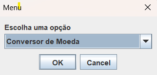
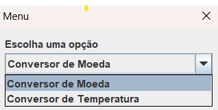
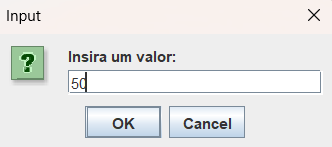
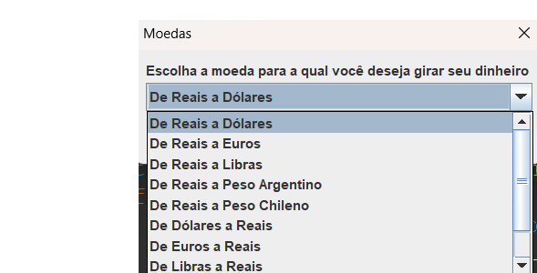
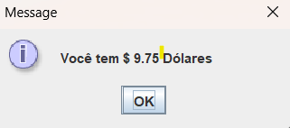
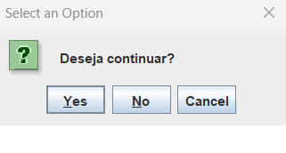
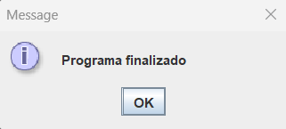

# Chalenge (JAVA) - Conversor 
 <br>
**Um conversor Generico de Moedas e Temperatura** 

## Indice
- <a href="Tipos de Conversão">Tipos de Conversão</a>
- <a href = "Layout">Layout</a>

## 🔗 Tipos de Conversão
###  💲Moedas
 > | De | Para | 
 > | - | - |
 > | Real | Dolar |
 > | Real | Euro |
 > | Real | Libras |
 > | Real | PesosArgentinos |
 <strong> As conversões tambem são feitas inversamente 🔁

### 🌡️Temperatura
 > | De | Para | 
 > | - | - |
 > | Celsius | Fahrenheit |
 > | Celsius | Kelvin |
 > | Kelvin | Fahrenheit |
 <strong> As conversões tambem são feitas inversamente 🔁

 ## 💻 Layout
- Tela inicial
> 
- Tela de Escolha
> 
- Entrada de valores
> 
- Escolha da Conversão
> 
- Conversão Final
> 
- Tela de opção
> 
- Tela Final
> 

## Instruçoes de Uso
```bash
# Faça um fork do projeto e Copie o link HTTPS e faça um git clone

$ git clone <link>

# No Eclipse em file > Open Projects from File System

# Clicar em Directory e localize o diretório do projeto "clonado"

# Execute a Class Principal.java para inicializar o programa.
```
## 📚 Bibliotecas Utilizadas
1. [java - lang](https://docs.oracle.com/javase/8/docs/api/java/lang/package-summary.html)
3. [java - util](https://docs.oracle.com/javase/8/docs/api/java/util/package-summary.html)
2. [javax - swing](https://docs.oracle.com/javase/8/docs/api/javax/swing/package-summary.html)